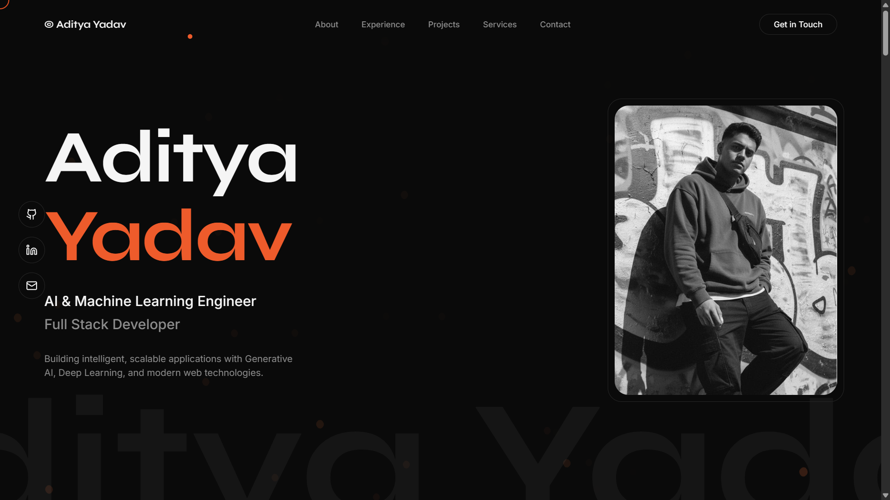
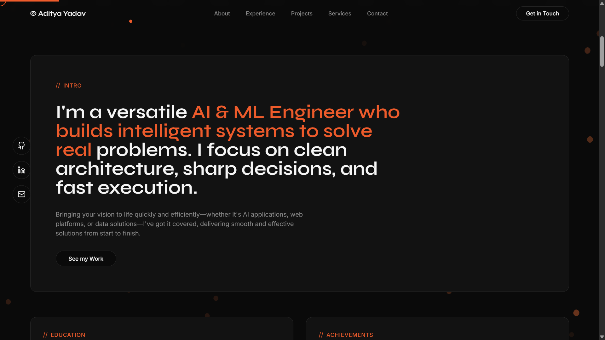
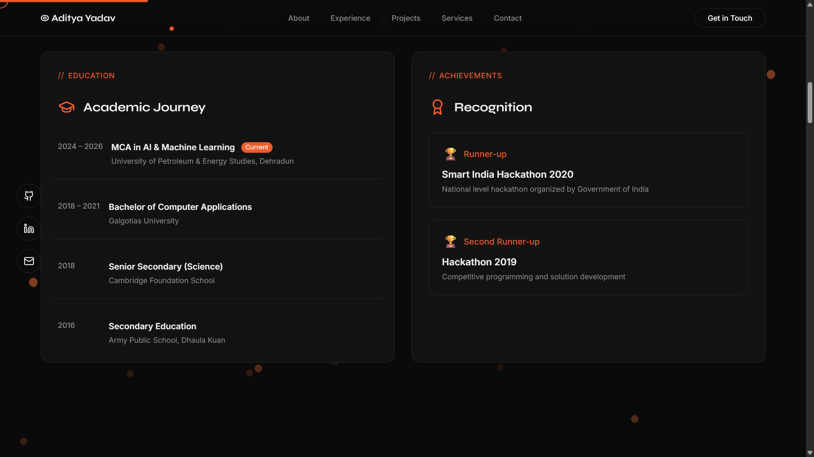
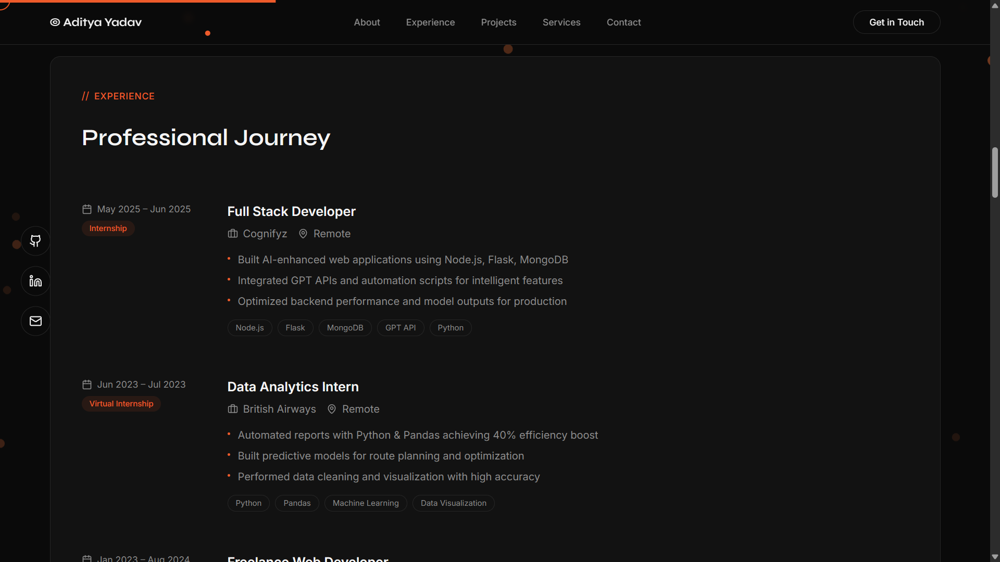
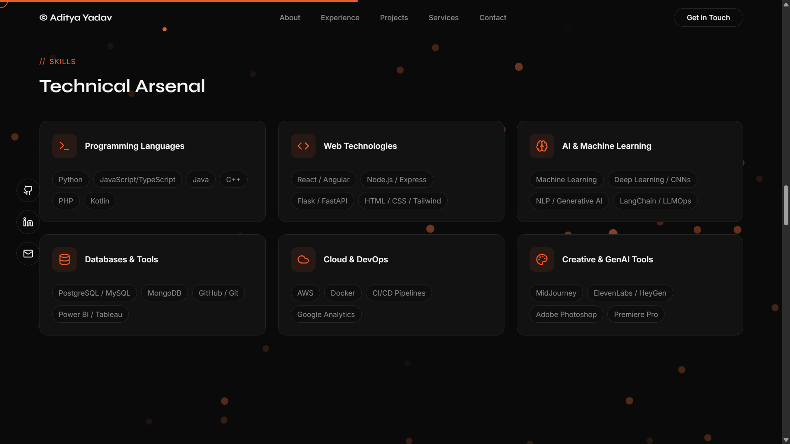

<div align="center">

# 🚀 Aditya Yadav — Portfolio Website

### **AI & Machine Learning Engineer | Full Stack Developer**

A stunning, modern, dark-themed portfolio website built with React, TypeScript, and cutting-edge web technologies — featuring 3D WebGL particle effects, Framer Motion animations, and a premium glassmorphic design system.

[](https://adityacodes.netlify.app)
[](https://github.com/AdityaYad12047)
[](https://www.linkedin.com/in/aditya-y-7644961aa/)


</div>

---

<div align="center">
  
</div>

---

## ✨ Features

<table>
<tr>
<td width="50%">

### 🎨 Design & UI
- **Dark-mode glassmorphic** design system
- **Coral-orange** `#F97316` accent branding
- **Responsive** — mobile-first, works on all devices
- **Custom cursor** with interactive tracking
- **Scroll progress** indicator
- **Ambient gradient orbs** for visual depth

</td>
<td width="50%">

### ⚡ Interactions & Animations
- **3D WebGL particle swarm** — ambient background
- **Framer Motion** slide-in, scale, stagger animations
- **Magnetic hover** effects on buttons & social links
- **3D tilt cards** on featured projects
- **Parallax text** on hero section
- **Text reveal** word-by-word animation

</td>
</tr>
</table>

---

## 📸 Screenshots

<div align="center">

### 🏠 Hero Section
> Cinematic name reveal with parallax text, magnetic social links, 3D particle swarm, and a grayscale-to-color profile photo on hover.


---

### 👤 About & Intro
> Bold intro statement highlighting AI/ML expertise, with a "See my Work" CTA and glassmorphic card design.



---

### 🎓 Education & Achievements
> Academic journey timeline (MCA AI/ML → BCA → Senior Secondary) alongside hackathon recognitions with trophy badges.



---

### 💼 Professional Experience
> Timeline-based experience cards with role details, company info, bullet-point highlights, and technology tags.



---

### 🧠 Technical Skills
> Six-category skill grid covering Programming, Web, AI/ML, Databases, Cloud/DevOps, and Creative/GenAI tools.



</div>

---

## 🏗️ Architecture

```
src/
├── components/
│   ├── Navbar.tsx              # Sticky nav with scroll-aware backdrop blur
│   ├── HeroSection.tsx         # Animated name reveal + parallax + profile
│   ├── AboutSection.tsx        # Education, achievements, intro card
│   ├── ExperienceSection.tsx   # Timeline with company details & tech tags
│   ├── SkillsSection.tsx       # 6-category skill grid (30+ skills)
│   ├── ProjectsSection.tsx     # Featured cards + "More Projects" table
│   ├── ServicesSection.tsx     # 6 numbered services with feature lists
│   ├── CertificationsSection.tsx # Badges + credential table
│   ├── ContactSection.tsx      # Working form (FormSubmit) + social links
│   ├── Footer.tsx              # Copyright + scroll-to-top
│   └── ui/
│       ├── InteractiveEffects.tsx  # Magnetic, TiltCard, TextReveal, Parallax
│       ├── WebcracySwarm.jsx      # 3D WebGL particle system (Three.js)
│       ├── CustomCursor.tsx       # Custom animated cursor
│       ├── ScrollProgress.tsx     # Top scroll progress bar
│       ├── motion-wrapper.tsx     # Framer Motion reusable wrappers
│       └── ... (shadcn/ui components)
├── pages/
│   ├── Index.tsx               # Main page — assembles all sections
│   └── NotFound.tsx            # 404 page
├── hooks/
│   └── use-toast.ts            # Toast notification hook
└── assets/
    └── profile-photo.jpg       # Profile photograph
```

---

## 🛠️ Tech Stack

| Category | Technologies |
|---|---|
| **Frontend Framework** | React 18 + TypeScript |
| **Build Tool** | Vite 7 (SWC) |
| **Styling** | TailwindCSS 3.4 + custom CSS design tokens |
| **Animations** | Framer Motion 11 |
| **3D Graphics** | Three.js + React Three Fiber + Drei |
| **UI Components** | shadcn/ui + Radix Primitives |
| **Form Handling** | React Hook Form + Zod validation |
| **Contact Backend** | FormSubmit.co (zero-config email API) |
| **Icons** | Lucide React |
| **Routing** | React Router DOM v6 |
| **Testing** | Vitest + Testing Library |

---

## 🚀 Getting Started

### Prerequisites

- **Node.js** ≥ 18
- **npm** ≥ 9 (or bun)

### Installation

```bash
# Clone the repository
git clone https://github.com/AdityaYad12047/Portfolio-Website.git

# Navigate to the project
cd Portfolio-Website

# Install dependencies
npm install

# Start development server
npm run dev
```

The app will be available at `http://localhost:5173`

### Build for Production

```bash
# Create optimized production build
npm run build

# Preview the production build
npm run preview
```

### Run Tests

```bash
# Run tests once
npm test

# Run tests in watch mode
npm run test:watch
```

---

## 📂 Sections

| Section | Description |
|---|---|
| **🏠 Hero** | Animated name reveal, parallax text, magnetic social links, grayscale-to-color profile photo |
| **👤 About** | Intro statement, education timeline (MCA AI/ML @ UPES, BCA @ Galgotias), hackathon achievements |
| **💼 Experience** | Professional timeline — Cognifyz, British Airways, Freelance, Hamari Pahchan NGO |
| **🧠 Skills** | 6 categories, 30+ technologies — Python, React, TensorFlow, LangChain, AWS, Docker, etc. |
| **🔬 Projects** | 8 projects — DID Auth System, MedAI, AI Story Generator, Heart Rate Detection, and more |
| **⚙️ Services** | 6 offerings — AI/ML Solutions, GenAI Apps, Full Stack Dev, Analytics, APIs, Computer Vision |
| **📜 Certifications** | Stanford IoT, GCP ML APIs, GSSoC badges, Cybersecurity, and more |
| **📬 Contact** | Working contact form (FormSubmit), email, phone, availability status, GitHub & LinkedIn |

---

## 🎯 Featured Projects

<table>
<tr>
<td width="50%">

### 🔐 DID Authentication System
> Decentralized Identity with AI fraud detection using blockchain (Solidity), wallet-based auth, and Random Forest ML.

`Node.js` `Flask` `Solidity` `React` `Random Forest`

</td>
<td width="50%">

### 🏥 MedAI — Diagnostic Engine
> Multi-modal healthcare AI combining vitals, imaging, PDFs, and clinical text for ICU risk prediction.

`Python` `TensorFlow` `OpenCV` `NLP` `Flask`

</td>
</tr>
<tr>
<td width="50%">

### 🎬 AI Story Generator
> Automated AI video pipeline using GPT narratives, MidJourney visuals, and ElevenLabs voiceovers.

`GPT API` `MidJourney` `ElevenLabs` `Python`

</td>
<td width="50%">

### ❤️ Heart Rate & Emotion Detection
> Real-time biometric and emotion detection with TensorFlow, OpenCV, and GUI visualization.

`TensorFlow` `OpenCV` `Python` `Deep Learning`

</td>
</tr>
</table>

---

## 🌐 Deployment

This project is deployed on **Netlify** with continuous deployment from the `main` branch.

| Platform | Status |
|---|---|
| **Netlify** | [](https://adityacodes.netlify.app) |

### Deploy Your Own

1. Fork this repository
2. Connect to [Netlify](https://netlify.com) / [Vercel](https://vercel.com)
3. Set build command: `npm run build`
4. Set publish directory: `dist`
5. Deploy! 🎉

---

## 🎨 Design System

The portfolio uses a carefully crafted dark-mode design system:

```css
/* Core Color Palette */
--background:    #0a0a0a    /* Near-black background */
--foreground:    #fafafa    /* Light text */
--primary:       #F97316    /* Coral-orange accent */
--card:          #0a0a0a    /* Card backgrounds */
--muted:         #262626    /* Muted elements */
--border:        #262626    /* Subtle borders */
```

**Typography**: `font-display` for headings, system stack for body text  
**Spacing**: 8px grid system with generous `py-24` section padding  
**Borders**: 1px subtle borders with primary-glow hover states  
**Cards**: `.card-dark` glassmorphic containers with hover elevation

---

## 📄 License

This project is open source and available under the [MIT License](LICENSE).

---

<div align="center">

### Built with 🧡 by Aditya Yadav

**AI & Machine Learning Engineer | Full Stack Developer**

[](mailto:aditya.12047@gmail.com)
[](https://github.com/AdityaYad12047)
[](https://www.linkedin.com/in/aditya-y-7644961aa/)

⭐ **Star this repo if you found it useful!** ⭐

</div>
